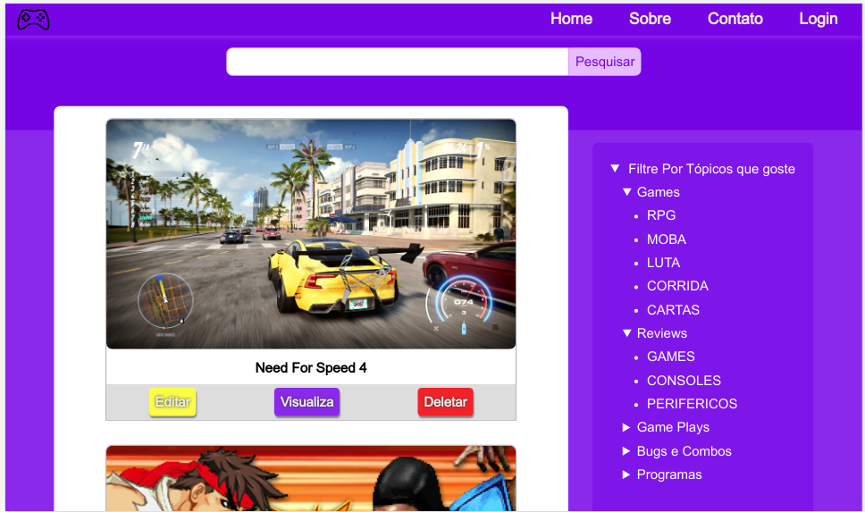
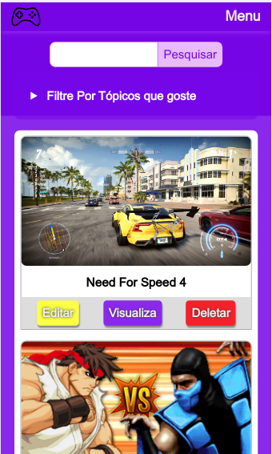
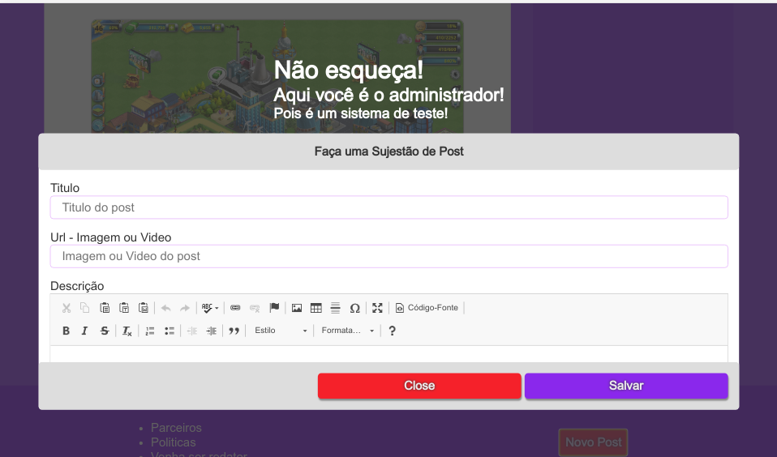
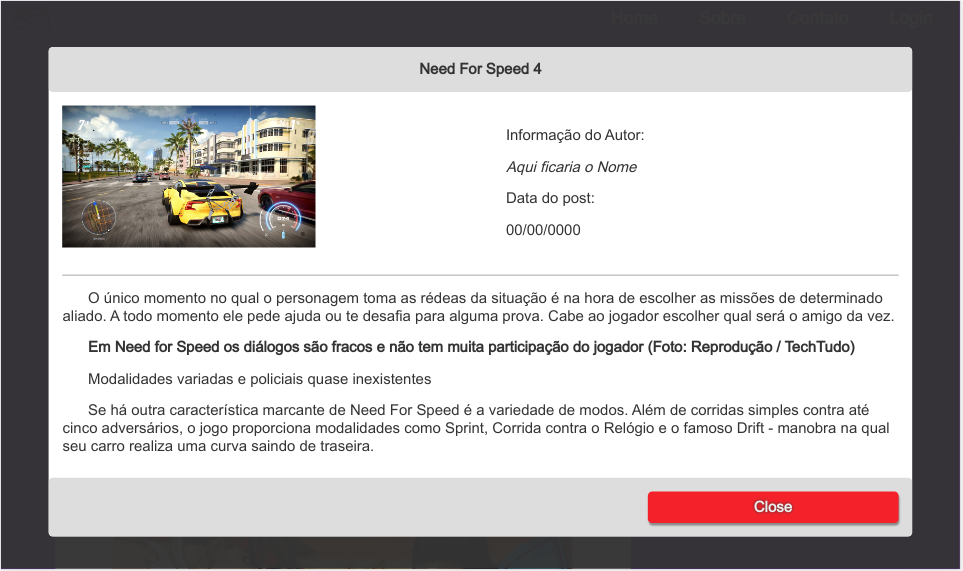

# blog-game

Um frontend de um blog simples para demonstrar conhecimentos em HTML, CSS e JS e um **backend** em PHP para aprofundar meus conhecimentos em leitora e escrita em aquivos, isto porque neste projeto os dados são gravados em um arquivo no formato json, não num banco de dados.

